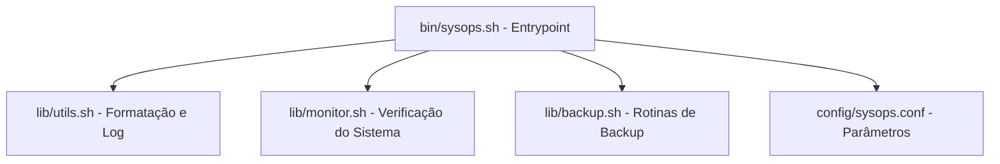

# CLI-Ops Toolkit

Uma suíte modular de automação e administração de sistemas em Bash/Shell Script, desenvolvida para simplificar tarefas de monitoramento, gestão de backups e diagnóstico de servidores Linux.

---

## Funcionalidades Principais (Em Desenvolvimento)

- **Diagnóstico do Sistema:** Verificação em tempo real de CPU, memória, consumo de disco e processos críticos.
- **Gestão de Backups:** Automação de cópias compactadas (tar.gz) com retenção e rotação configurável.
- **Geração de Relatórios:** Exportação do estado do sistema em formato formatado para análise.
- **Arquitetura Modular:** Separação clara entre entrypoint, bibliotecas reutilizáveis e configurações.

---

##  Arquitetura do Projeto

---

##  Requisitos do Sistema
- Linux (Debian/Ubuntu/CentOS ou WSL2)
- Bash
- Ferramentas padrão: tar, df, free, cron

---

## Autor

Desenvolvido por **Matheus Linhares Teixeira**
- LinkedIn: [https://www.linkedin.com/in/matheus-linhares-teixeira-0a5589335/]

## Licença

Este projeto está licenciado sob a [GNU General Public License v3.0 (GPLv3)](LICENSE).